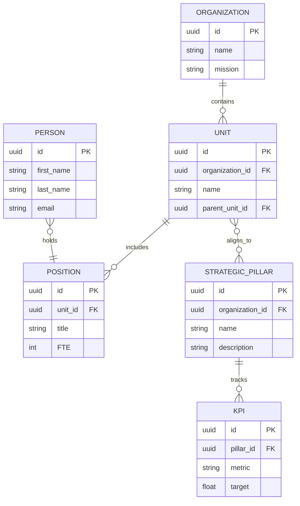

# Data Model

```mermaid
erDiagram
    ORGANIZATION ||--o{ UNIT : contains
    UNIT ||--o{ POSITION : includes
    PERSON }o--|| POSITION : "holds"
    STRATEGIC_PILLAR ||--o{ KPI : tracks
    UNIT }o--o{ STRATEGIC_PILLAR : "aligns_to"

    ORGANIZATION {
        uuid id PK
        string name
        string mission
    }
    UNIT {
        uuid id PK
        uuid organization_id FK
        string name
        uuid parent_unit_id FK
    }
    POSITION {
        uuid id PK
        uuid unit_id FK
        string title
        int FTE
    }
    PERSON {
        uuid id PK
        string first_name
        string last_name
        string email
    }
    STRATEGIC_PILLAR {
        uuid id PK
        uuid organization_id FK
        string name
        string description
    }
    KPI {
        uuid id PK
        uuid pillar_id FK
        string metric
        float target
    }
```
